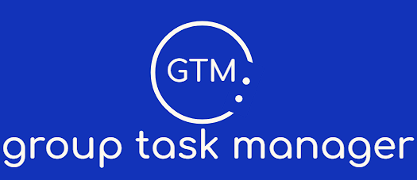
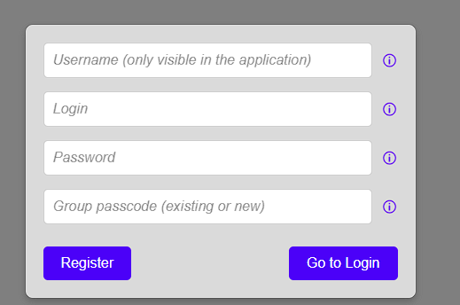
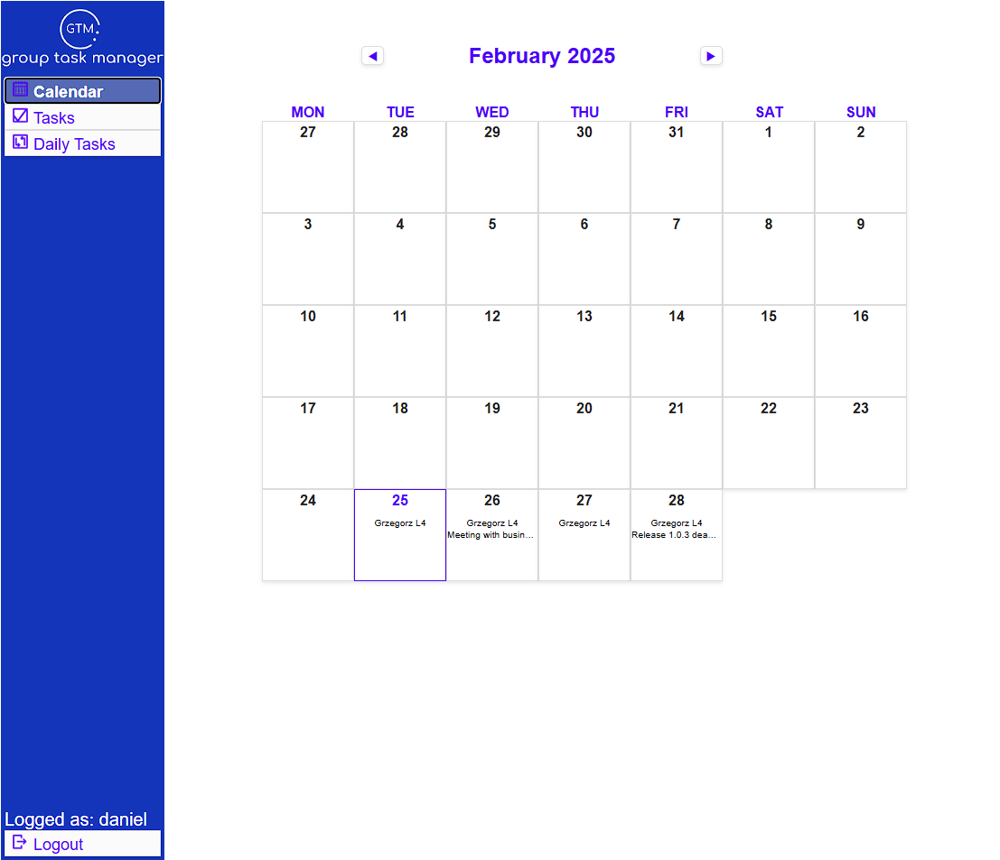
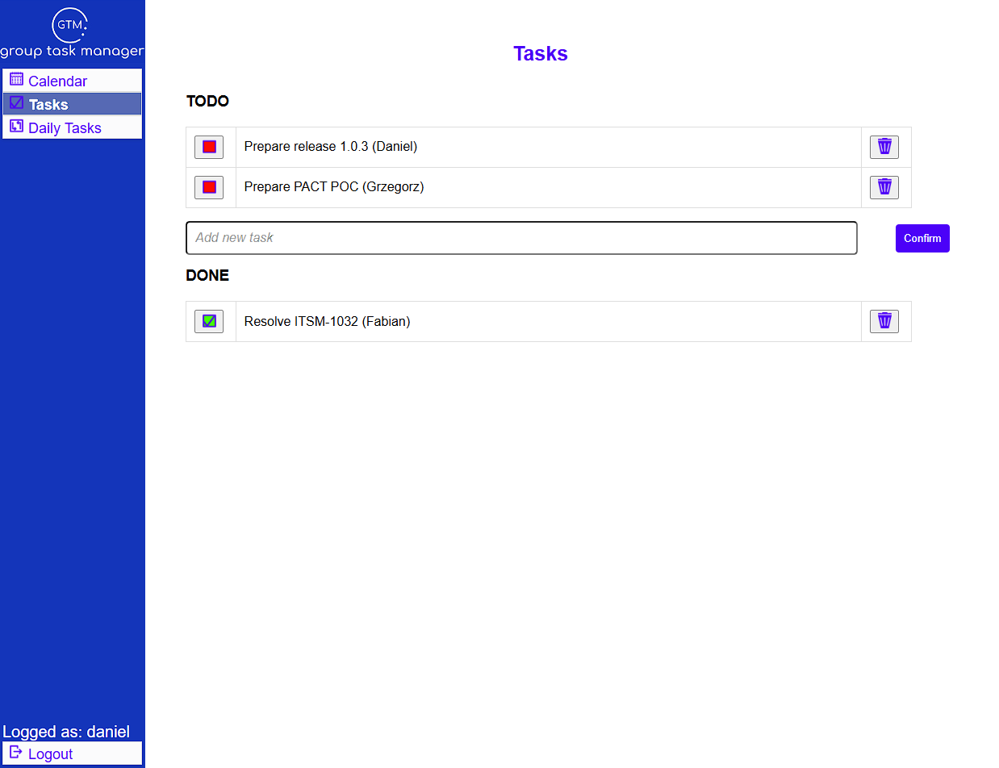

  

Try it out here (requires simple registration): https://group-task-manager.up.railway.app 

This repository contains frontend and backend for the GroupTaskManager application, used to manage tasks and events between members of a group. 

# Main Stack
* **Language:** Java 17
* **Framework:** Spring Boot 3.4.0
* **Database:** PostgreSQL
* **Build tool:** Gradle
  
* **Frontend:** Angular

# Backend Technologies

* Spring Boot: Web, Security, Data JPA
* ORM: Hibernate
* Security: Spring Security, JWT
* Mapping: MapStruct 
* Testing: JUnit

# Using GTM
Each user belongs to a group. Members of each group can see all events, tasks and daily tasks created by the users of the group.

## Registering
Create a new account. Use an existing group passcode to enter an existing group and share tasks and events with its members.
If not, create your own group passcode and share it with other users to join your group!

  

   

   
    
   

